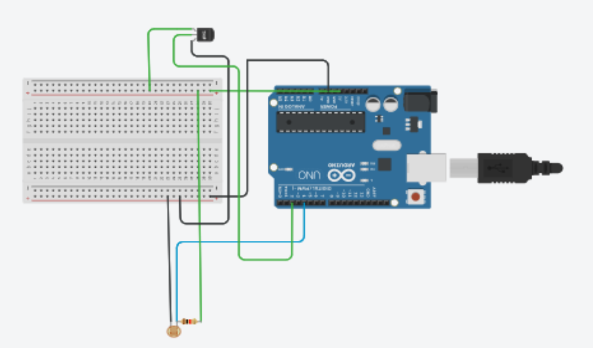
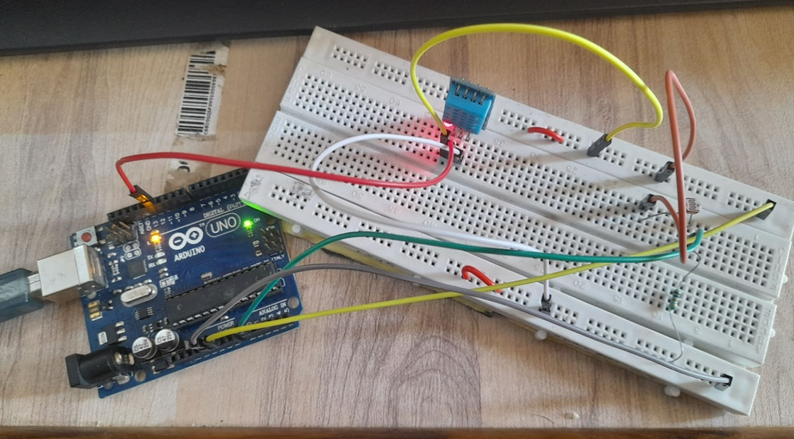
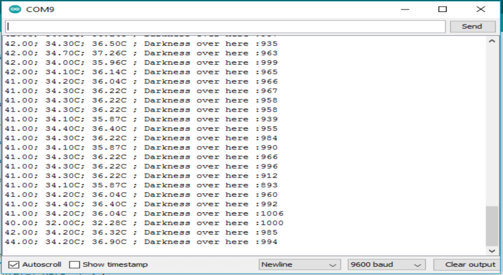
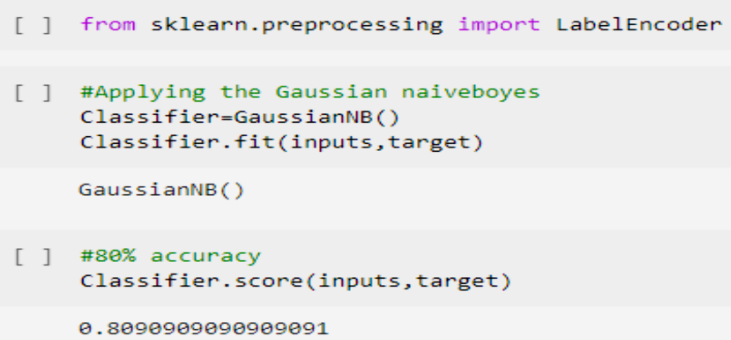
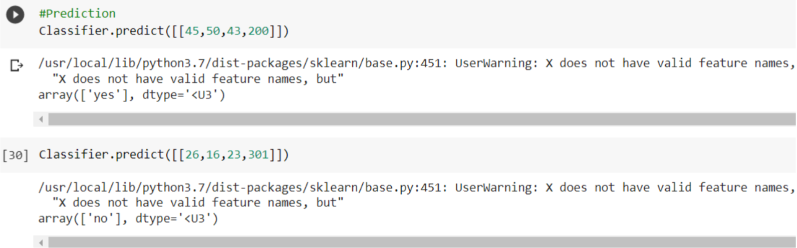

# Outdoor Activity Recommendation System Using IOT


## Introduction
Weather predictions are important forecasts because they are used to protect life and property.Weather predictions are created by gathering objective data about the actual condition of the atmosphere at a certain location and using meteorology to predict how the weather will behave in the future. 


## Problem Statement
To predict the weather condition based on Atmospheric pressure, Humidity, Temperature and Darkness level (cloudy or sunny weather), information for any specific area and to suggest people whether  to go for outdoor  activities or not.
## Group Members

- [Ashly John](https://github.com/ADJ46)
- [Mukesh Gupta](https://github.com/mukesh2001)
- [Himanshu Chaurasiya ](https://github.com/Himanshuchaurasiya1234)
- [Vikas Chaurasiya](https://github.com/vikas-348)
## Circuit Diagram


### Hardware Requirement
```
1.DHT11(temperature and humidity)
2.LDR(Light)
3.R2 100k ohm 
4.Arduino UNO
5.Breadboard 
```
### Software Requirement
```
1.Any operating System supporting Arduino IDE
2.Arduino IDE
```

A Breadboard has two side with series connection so one side of the Breadboard was made ground and another side was made 5v ie power supply by connecting the Breadboard and Arduino through wire.
DHT11 has 3 pin to it one for ground one for vcc which goes in the 5v side and the output pin which is connected to the 13 slot of the arduino. To use LDR we needed a resistor as the LDR could not directly handle high voltage. Output from the LDR is connected to the 0 slot of Arduino.


## Implementation


## Output


The output is obtained on the serial monitor of Arduino ie Humidtiy, Temperature, Heat Index, and The light Intensity

The output is then used to obtain the prediction by applying naive bayers algorithm

## Algorithm Accurarcy


## Prediction



## Conclusion
We have successfully built a system that calculates the temperature , Humidity, Heat Index and Light intensity of a specific area and applied Naive Bayes Algorithm on the collected data. On applying the algorithm we have got an accuracy of 80% and also performed predictions on the data.


## Documentation
- [Project PPT](Document/Presentation.pptx)
- [Project Report](Document/Report.pdf)
